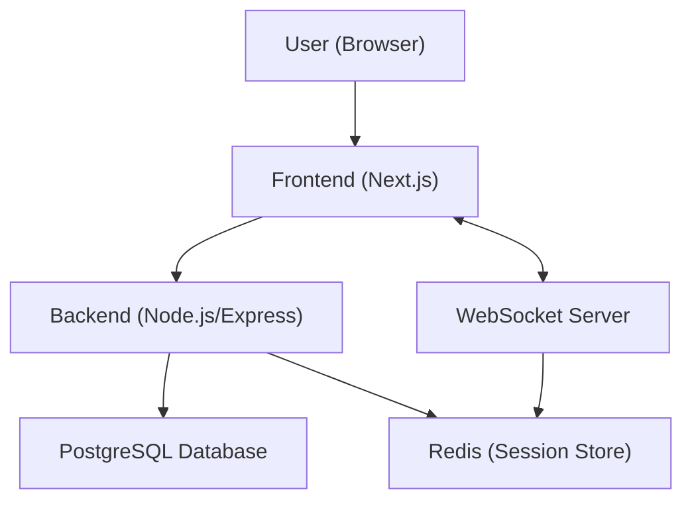

# System Architecture Overview

**Description:**
- The user interacts with the Next.js frontend.
- The frontend communicates with the backend (Node.js/Express) for API requests.
- The backend uses PostgreSQL for persistent data and Redis for session storage.
- The frontend also connects to a WebSocket server for real-time features (like live comments).
- The WebSocket server uses Redis for presence/session management.

**Communication Protocols**

*REST*: The frontend communicates with the backend using HTTP REST APIs for actions like posting and fetching comments (e.g., POST /api/comments, GET /api/comments).

*WebSocket*: Real-time features such as live comment updates and typing indicators use WebSocket connections for instant, bidirectional communication between client and server (e.g., ws://your-backend.com/ws).

**List security precautions**
1. Session-Based Authentication with Secure Cookies
2. Password Hashing
3. CSRF Protection
4. Environment Variable Management
5. CORS Policy

**To scale the collaborative comment system to 10K+ users, the following actions are critical**

1. **Set Up PostgreSQL Read Replicas**
   - Distribute read queries across multiple database replicas to prevent the primary database from becoming a bottleneck and to improve read performance.

2. **Implement Redis Clustering**
   - Move from a single Redis instance to a Redis cluster with multiple nodes for high availability, better performance, and to handle increased cache/session loads.

3. **Horizontal Scaling of Application and WebSocket Servers**
   - Deploy multiple backend and WebSocket server instances behind a load balancer to handle thousands of concurrent users and connections, improving reliability and scalability.

4. **Introduce a CDN for Frontend Assets**
   - Use a Content Delivery Network (CDN) like Cloudflare or AWS CloudFront to globally cache and accelerate static assets, reducing server load and improving load times for users everywhere.

5. **Implement Robust Monitoring and Auto-Scaling**
   - Set up comprehensive monitoring, alerting, and auto-scaling to detect issues early, automatically scale resources, and maintain high availability as user demand increases.
